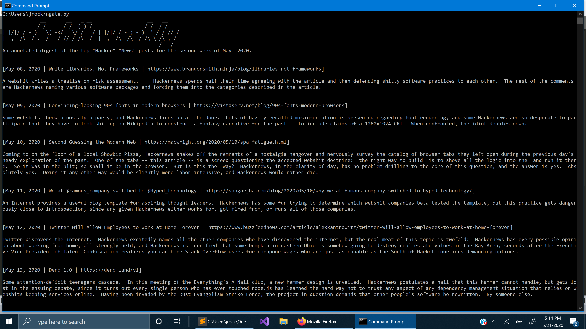

# Hacker News
Fetch the front page of Hacker News

# N-Gate
Ironically read the n-gate's latest post, most likely an annotated digest of the top "Hacker" "News" posts

# /r/whatstheword
Fetches /r/whatstheword/top/ and allows you to choose a post to read its comments

Usage: `python wtw.py [1hr | 24hrs | week]`

# Github Trending
Gathers the day's trending Python repositories on Github and displays brief info about them

